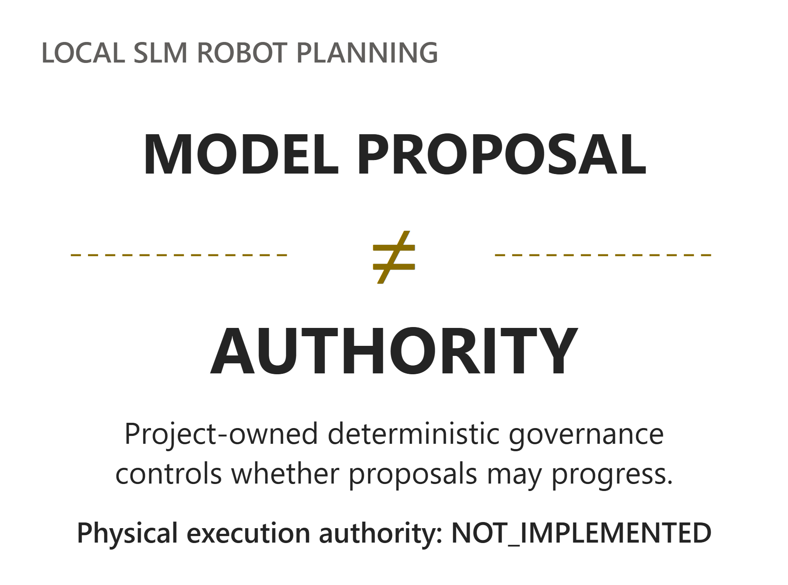

# Schema Validity Is Not Enough

Governing Local SLM Robot Planning with [Microsoft Foundry Local](https://learn.microsoft.com/en-us/windows/ai/foundry-local/get-started)

**Guest post by Adhish Rao, MSc Systems Engineering for the Internet of Things, UCL**

*Developed through UCL's Industry Exchange Network (IXN) with Microsoft industry supervision.*



Valid JSON was only the first hurdle.

In one 30-command local Qwen2.5-Coder-0.5B run, 25/30 responses passed the schema, but only 4/30 could progress to the next governed qualification step. We call that state execution eligibility.

That gap captures the question at the centre of my UCL IXN MSc project: how can a small language model (SLM) remain useful as a proposal generator without inheriting authority over what happens next?

Microsoft Foundry Local supplied the local inference runtime. I treated each model response as an untrusted task proposal; a separate, project-owned deterministic governance layer controlled whether it could progress.

The model could propose a task, but it could not grant itself permission.

This article draws on the evidence frozen in my submitted dissertation, Zero-Trust Governance for Local SLM Robot Task Planning.

## Local AI changes deployment, not trust

Microsoft Foundry Local provides model management, local caching, hardware-aware execution and inference interfaces. Once the required model and runtime components are available locally, inference can operate without a cloud request.

Those properties can matter when an application needs offline operation or local processing of prompts and outputs. They do not guarantee lower latency, better answers, or a safer application. An application can also have other network dependencies; the local inference path does not make the entire system offline.

Foundry Local supplied the inference runtime in this project. It did not supply the deterministic governance layer, and its product capabilities are separate from the historical configurations we measured.


Foundry Local provides the runtime; project-owned governance separately controls progression.

## When valid JSON still isn't enough

Consider a request to move a blue component from input tray A to assembly fixture B.

Conceptual example — a simplified proposal, not the production API contract:

```json
{
  "operation": "MOVE",
  "object": "blue_component",
  "source": "tray_A",
  "destination": "fixture_B"
}
```

A parser can establish whether the response is JSON. A schema can check its shape. Neither alone establishes that the proposal matches the request or is admissible under the project's rules.

Structural validity and task admissibility answer different questions. Does the proposal preserve the intended task? Is required context missing? Does a policy prohibit the requested action? Structural conformance cannot answer all of them.

## Separating proposal from authority

The system separates proposal generation from authority, a design developed across five prototypes. Each stage examined another trust assumption: structure, deterministic validation, empirical measurement, containment, and integrated local-AI operation.

The final system keeps the responsibilities separate. Typed commands and operator-reviewed transcripts enter a common command path. The selected inference path supplies an untrusted proposal. Deterministic checks then evaluate whole-response parsing, schema, semantics, ambiguity and project-defined policy.

The governance outcomes are ACCEPT, CLARIFY and REJECT. Only ACCEPT establishes execution eligibility. Clarification and rejection preserve the authority boundary when a proposal cannot progress.

Even ACCEPT grants only eligibility for a separately bounded qualification step. It does not establish geometric feasibility, dynamics, physical safety or robot-control authority.

The demonstrator can display frozen qualification evidence. That evidence has its own provenance: it was not generated from the fresh proposal shown beside it. A developer inspecting the system must be able to distinguish the proposal record, the governance decision and the qualification record.

![Typed or operator-reviewed input enters selected probabilistic inference, producing an untrusted proposal. An authority boundary precedes project-owned deterministic governance: whole-response parsing, schema, semantics, ambiguity and policy. Only ACCEPT leads to execution eligibility and a separately bounded qualification step. CLARIFY or REJECT leads to no progression. Independently sourced frozen qualification evidence is not derived from the fresh proposal. Physical execution authority is NOT_IMPLEMENTED.](figures/blog/fig04_zero_trust_architecture.png)

Only ACCEPT establishes execution eligibility; downstream qualification and physical execution authority remain separate.

## What the experiments showed

The opening example came from the model benchmark (P3), which evaluated four Qwen configurations. Each used 30 commands. Across those configurations, schema-validity rates ranged from 46.7%–93.3%, while execution-eligibility rates ranged from 6.7%–16.7%.

For the selected Qwen2.5-Coder-0.5B run, the useful comparison remains 25/30 schema-valid versus 4/30 execution-eligible. In that same run, 12 responses were classified as model-level false accepts under the project benchmark. This is a proposal-evaluation classification, not another stage in the 25→4 funnel or a count of physical incidents.

For me, the engineering lesson was direct: reporting schema validity as task accuracy or permission to act would hide important failures. The result is bounded to the evaluated commands, models and runtime configurations; it is not a general reliability estimate for local SLMs.


Selected 30-command run: 25/30 schema-valid and 4/30 execution-eligible; 12 model-level false accepts are reported separately.

## Where the failures actually came from

Low eligibility alone does not tell us whether the model failed or governance was too restrictive. We examined that distinction across 40 clear-command observations.

Of those observations, 35 were schema-valid and 14 were execution-eligible. The 26 non-eligible observations comprised:

- 5 structural failures;
- 17 semantic proposal failures;
- 4 repeated ambiguity over-rejections.

Thus, 22 of the 26 non-eligible observations failed upstream in proposal quality. But deterministic governance was not infallible either.

One clear command, C10, was “Pick up the gauze pack and place it on the tray”. The deterministic ambiguity heuristic treated the pronoun “it” as an ambiguous_reference.

The same command produced the repeated over-rejection across all four model configurations. This exposes one repeated rule failure, not four independently sampled commands. We therefore do not interpret 4/40 as a population false-reject rate.

In the earlier model benchmark (P3), this ambiguity was recorded as a rejection. The final qualified resolver instead maps an ambiguity-only state to CLARIFY, so the case is evidence about the ambiguity rule—not proof that the two contract versions used identical decision labels.

The developer lesson is direct: deterministic does not mean correct. Governance specifications need validation too.

## What stricter admission rules revealed

The admission-rule comparison (P4) applied progressively stronger rules to the same 120 retained records:


Same 120 retained records; dependent retrospective reclassification. The 14 retained successes are previously classified records.

The containment evidence is stronger than the utility evidence: utility here means only that the 14 previously successful records survived the stricter admission rules.

This is not a randomised causal ablation or Pareto optimisation, and it provides no physical-safety result or evidence of zero future risk.

The exact-score admission stage required a semantic score of 1.0 (P4), a stricter condition than the earlier model benchmark’s semantic-pass metric (P3).

The project-authored reference intents and deterministic scorer were version-controlled before the retained Foundry runs, and replay reproduced all 120 stored semantic outcomes. They were not independently annotated or inter-rater validated.

## Local and cloud were a deployment trade-off

A separate experiment examined deployment behaviour rather than admission policy. The retained local/cloud configuration comparison (Mode C) completed 30/30 requests in both configurations. Mean latency was 1.75 seconds for cloud and 7.03 seconds for local. Cloud responses were also more consistently JSON-valid in that comparison.

The models and deployment configurations differed. These are configuration-level observations, not a causal estimate of what moving an otherwise identical system from cloud to local would change.

A separate resource-profiling run measured 30 successful local requests (Mode D). Estimated mean Foundry-process CPU use was 48.3% of total logical CPU capacity on the tested host. This was a separate resource measurement, not part of the local/cloud latency comparison (Mode C).

Choose local AI for deployment requirements, then measure latency and resource pressure on the intended hardware.

## Voice must not create another authority path

Speech introduced another source of uncertainty, so raw transcription remained non-authoritative until explicit operator review. Reviewed text then entered the same governance path as typed input.


Reviewed voice and typed input converge on the same governance path; input modality grants no authority.

In the typed-versus-reviewed-voice invariance test, 18/18 tested pairs produced the same governance outcome (D4.3). That supports the shared authority path for those tested pairs; it is not an ASR-accuracy or human-factors study.

A subsequent real-microphone boundary test exercised seven valid attempts (D4.5). Six reviewed commands were submitted, and one transcript was discarded client-side. In one observed transcription, “input tray A” became “input trait A”; the operator corrected it before submission.

The next failure occurred elsewhere. All six submitted planner responses failed canonical whole-response parse/JSON checks because they wrapped JSON in Markdown code fences, violating the strict whole-response JSON contract expected by the parser. Downstream semantic, ambiguity, policy and authority predicates were NOT_ASSESSABLE. These were parse failures, not safety rejects.

Explicit review prevented raw ASR text from silently becoming the submitted command. Strict parsing then exposed a separate planner-interface failure. Neither observation establishes that operators reliably catch transcription errors or that the speech system is safe.

## Why we deliberately kept a failed qualification result

The frozen downstream qualification remained a FAIL (B3.2), with 118 support-material penetration findings and zero physics steps. We did not change the route or scene just to turn the result into a pass.

This was discrete geometric qualification. It did not establish continuous collision freedom, dynamic executability or physical safety.

The failure makes another boundary visible: execution eligibility and downstream qualification are different properties. A frozen replay can show that distinction; it cannot grant physical execution authority.

## A practical checklist from this project

Seven design lessons may transfer beyond robotics:

- Choose local AI for deployment requirements, not assumed superiority.

- Treat generative output as untrusted proposal data.
- Separate structural validity from authority.
- Keep deterministic governance outside probabilistic generation.
- Validate the governance rules too.
- Do not let new modalities create new authority paths.
- Preserve negative evidence and keep qualification stages separate.

The same authority-separation pattern may also be useful where generated actions influence consequential systems, such as infrastructure changes or agent tool calls. These are design analogies, not domains evaluated by this project.

### A related Microsoft open-source pattern

Microsoft's [Agent Governance Toolkit](https://github.com/microsoft/agent-governance-toolkit) addresses a related architectural problem by placing deterministic policy controls on agent actions. Prototype 5 did not implement or evaluate the toolkit; the comparison is architectural rather than an implementation dependency.

## Where this work stops

The MSc result concerns software governance under the evaluated models, records and project-defined rules. It is not a physical safety case, a certified controller or evidence of production robot authority. Physical execution authority remains NOT_IMPLEMENTED.

Here, “zero trust” describes an authority principle: no preceding success automatically grants authority at the next boundary; it is not a claim of NIST SP 800-207 implementation or conformance.

## What comes next

The next questions require broader validation, independent evaluation of policy artefacts and deeper quantitative analysis of model behaviour. Physical extension would require additional assurance before execution authority could be considered.

I began with a generation question: can a local SLM produce a valid robot task proposal? I ended with an authority question: what must that proposal survive before anything downstream is allowed to trust it?

In this prototype, the model supplied proposals. Deterministic governance separately controlled whether they could progress—and the governance itself remained something to test.

## Acknowledgements

This project was developed through UCL's Industry Exchange Network as part of the MSc Systems Engineering for the Internet of Things, with academic supervision from UCL and industry supervision from Microsoft.

## Resources

- [Microsoft Foundry Local documentation](https://learn.microsoft.com/en-us/windows/ai/foundry-local/get-started)
- [UCL Industry Exchange Network](https://www.ucl.ac.uk/engineering/computer-science/collaborate/ucl-industry-exchange-network-ucl-ixn)
- [Microsoft Agent Governance Toolkit](https://github.com/microsoft/agent-governance-toolkit)
